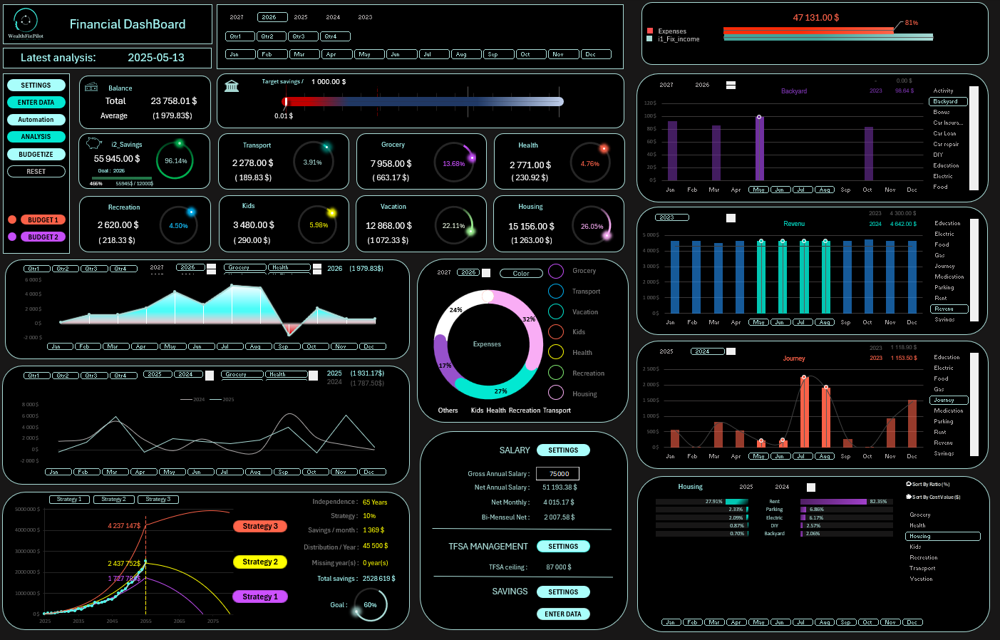
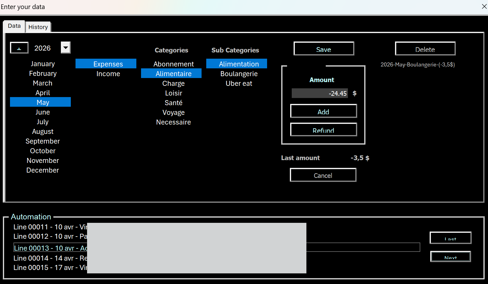
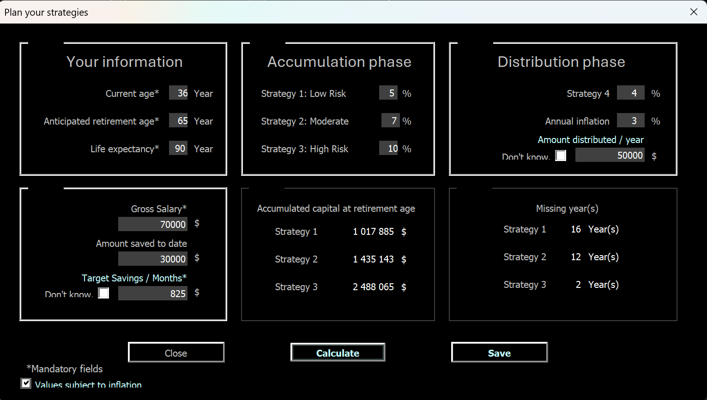
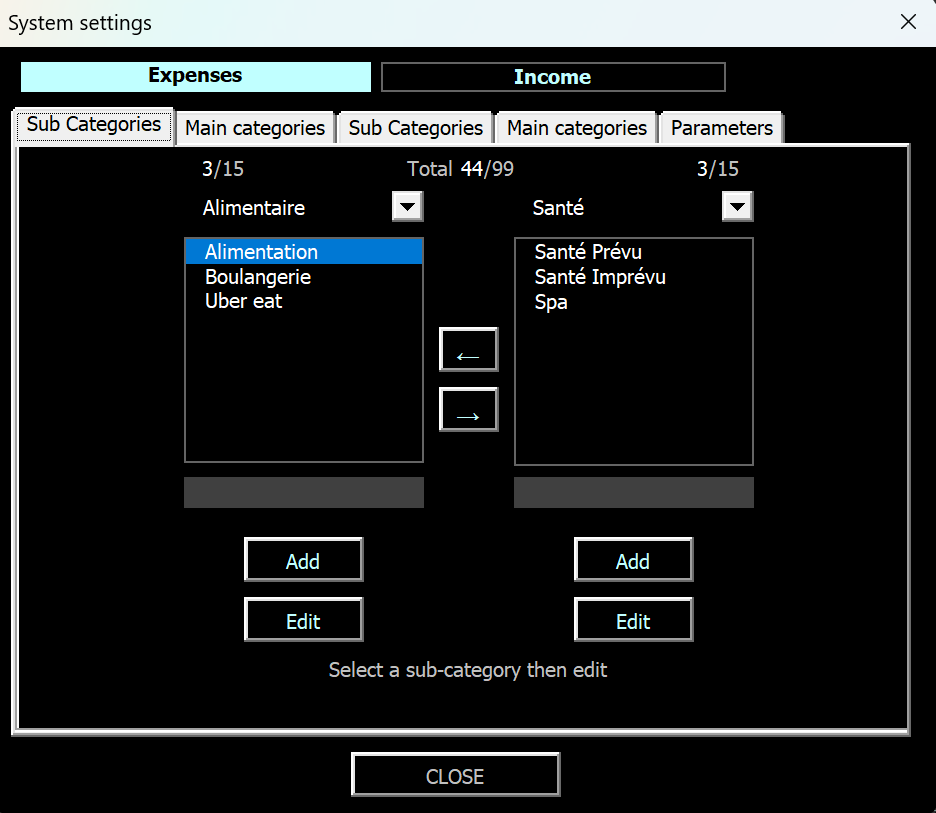
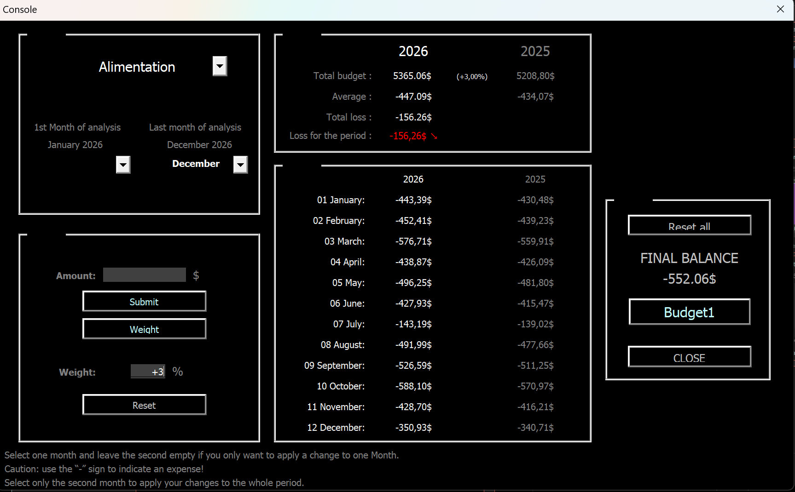
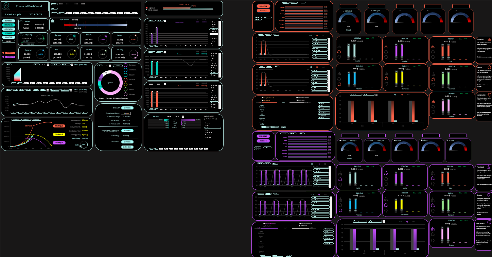
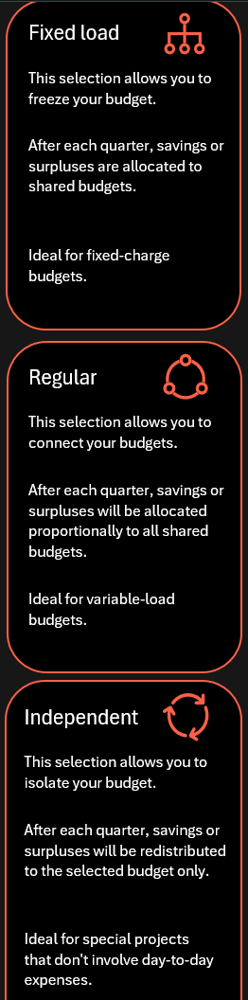

# WealthFinPilot

**Personal finance management tool — Excel / VBA**




---

# Why this project exists

At a point in my life where I needed to plan ahead. — I asked myself a simple question: *why not apply the same analytical rigour I use at work to my personal finances?*

WealthFinPilot started as a personal challenge. It became something more: the project where I learned to think like a data person, structure complex information, design for usability, and build something that actually gets used — by me, every month.

This is where my journey into data seriously began.

## Overview

WealthFinPilot is a personal finance tool built in Excel and VBA. It covers the full cycle from raw transaction data to structured analysis and forward planning, while keeping all data local in a single Excel file.

Problems addressed:
- Centralise personal transactions (income and expenses)
- Structure and personalise spending categories
- Semi-automate data entry from bank exports
- Build annual budgets
- Track financial KPIs and savings targets
- Visualise financial data in an interactive dashboard

---

## Features

### Navigation

Four main modules accessible from the dashboard:

| Module | Description |
|---|---|
| **Settings** | Configure expense and income categories and subcategories |
| **Data Entry** | Manual and semi-automated transaction entry via UserForms |
| **Automation** | Bank CSV import, parsing, and guided categorisation |
| **Budgetize** | Annual budget builder, extrapolation, KPI tracking |

### Capabilities

**Data entry and import**
- Guided entry via UserForms — no direct spreadsheet cell interaction
- Bank export import from multiple CSV formats
- Semi-automated categorisation transaction by transaction
- Up to 15 subcategories per category; 99 entries in the reference table

**Analysis and visualisation**
- Interactive dashboard as the central interface
- Dynamic charts: butterfly chart, quarterly speedometers
- KPI tracking against financial targets
- Expense breakdown by category and subcategory, as a proportion of income

**Planning**
- Annual budget builder with fixed-value or weighted adjustment
- Dual budget management (Budget1 / Budget2)
- FIRE number calculation — three growth strategies (low, moderate, high)
- Inflation-adjusted and nominal projections
- Monthly savings targets and registered account ceiling tracking

**Other**
- Multilingual interface: English · Français · Español · Deutsch · 中文
- All data stored locally — no third-party dependency

---

## Architecture

```
Bank export / manual entry
        ↓
Import or entry via UserForms
        ↓
Guided categorisation (Triage engine)
        ↓
Consolidation into Master database
        ↓
Budgets · KPIs · Extrapolation · FIRE calculation
        ↓
Dashboard and visualisations
```

### VBA modules

| File | Type | Role |
|---|---|---|
| `Automate.bas` | Module | Bank CSV import and parsing |
| `Triage.bas` | Module | Transaction consolidation engine |
| `Build_Budget.bas` | Module | Budget dataset construction |
| `Extrapolation.bas` | Module | Budget extrapolation and multilingual support |
| `Chart_Analyse.bas` | Module | Dynamic chart updates |
| `AddButton.bas` | Module | Dynamic button management |
| `APIForm.bas` | Module | Windows API utilities for UserForm rendering |
| `InputData.frm` | UserForm | Manual and semi-automated transaction entry |
| `ChangeCAT.frm` | UserForm | Category management (add, move, rename) |
| `AutoAsk.frm` | UserForm | Bank source and import format selection |
| `MOY.frm` | UserForm | Budget adjustment console (averages and weightings) |
| `SETEP.frm` | UserForm | Long-term financial planning and FIRE calculation |
| `ExtraP.frm` | UserForm | Extrapolation parameters |
| `Epargne.frm` | UserForm | Annual savings target entry |
| `EPProgress.frm` | UserForm | Capital savings progress recording |
| `NetIncome.frm` | UserForm | Tax bracket input for net income calculation |
| `CELIF.frm` | UserForm | Registered account contribution ceiling |
| `AddAn.frm` | UserForm | Add a new year to the tracking period |
| `AddCat.frm` | UserForm | Add a subcategory |
| `InputAsk.frm` | UserForm | Dialog for unrecognised transactions during sorting |
| `Sheet2 - Input.cls` | Class | Input sheet module (entry, extrapolation, analysis) |
| `Sheet3 - WB_Data.cls` | Class | WB_Data sheet module (buttons, settings) |
| `Sheet5 - DashBoard.cls` | Class | Dashboard module (interactivity, budget views, KPIs) |

---

## Stack

| Tool | Usage |
|---|---|
| Excel (Windows) | Interface, data structure, visualisations |
| VBA | Business logic, automation, UserForms |
| Power Query | Data import and transformation |

---

## Screenshots

<table>
  <tr>
    <td><br><sub>Data Entry — transaction input via UserForm</sub></td>
    <td><br><sub>FIRE — long-term planning, 3 growth strategies</sub></td>
  </tr>
  <tr>
    <td><br><sub>Settings — subcategory management</sub></td>
    <td><br><sub>Budgetize — budget adjustment console</sub></td>
  </tr>
  </tr>
         <td><br><sub>Main Dashboard with 2 independents yealry budgets</sub></td>
    <td><br><sub>An actionnable yearly budget</sub></td>
  </tr>
</table>

---

## Demo videos

| # | Topic | Link |
|---|---|---|
| 1 | Dashboard overview and navigation | [YouTube](https://youtu.be/nTWMh1e4jyk?si=sRZnfef-LQMsTBdW) |
| 2 | Settings — category personalisation | [YouTube](https://youtu.be/6Szk2CZGKi8?si=WFZgW6bQPxG6PRXE) |
| 3 | Automation — bank import and categorisation | [YouTube](https://youtu.be/oVEUhhg7ReM?si=Dd4NQwhqB-EjtVJB) |
| 4 | FIRE — long-term financial planning | [YouTube](https://youtu.be/ehYVkPfbrTc?si=YeQEJZ6kY1k4M6UK) |
| 5 | Budgetize — budget management and KPIs | [YouTube](https://youtu.be/-tL8nu7FVmA?si=OMG6UFCnp1Fj0PNf) |

---

## Project structure

```
wealthfinpilot/
├── README.md
├── /vba              ← VBA modules (.bas, .cls, .frm)
├── /docs             ← Architecture diagrams, screenshots
└── /media            ← Demo video links
```

---

## Installation and requirements

- Microsoft Excel 365 (Windows) with macros enabled
- Mac compatibility: not verified

> A step-by-step setup guide and demo file are not yet available in this repository.

---

## Known limitations

- Designed for personal finance tracking; not for investment portfolio analysis.
- Data is stored locally in the Excel file; no multi-user or cloud support.
- Performance on large transaction volumes: not tested at scale.

---

## Status

Stable. In active personal use.

---

## License

MIT — see [LICENSE](LICENSE)
